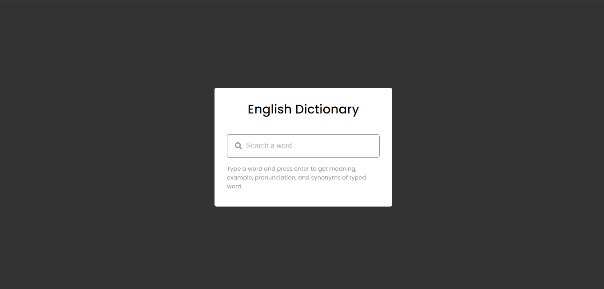
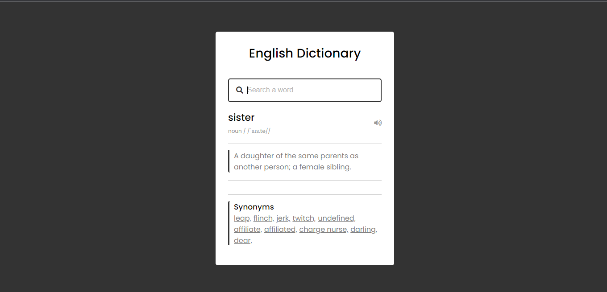
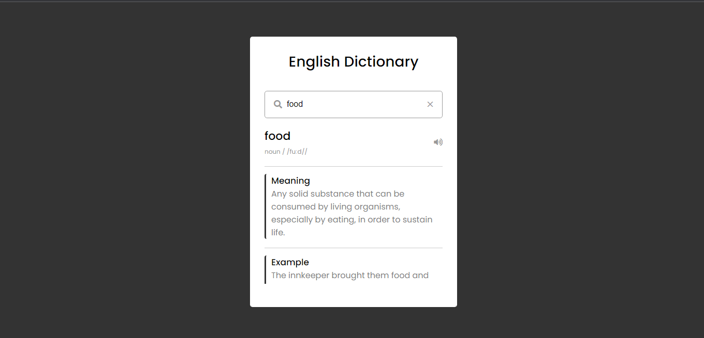
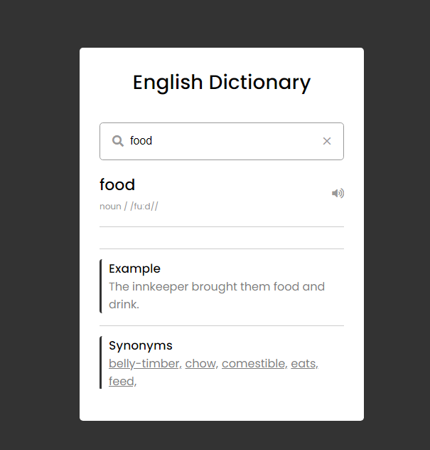

# Dictionary app built with dictionaryapi.dev API

## Table of contents

- [Overview](#overview)
  - [The Challenge](#the-challenge)
  - [Screenshot](#screenshot)
  - [Links](#links)
- [Author](#author)
- [Acknowledgements](#acknowledgements)  

## Overview

Dictionary app inspired by codingNepal

### The Challenge

Users should be able to:

- View the optimal layout for the site depending on their device's screen size.
- Search any word of their choice and get the meaning, example, synonyms and pronunciation of the word.
- Incase the example or synonyms of the word typed in is not available, the display of the parentElement is set to a display of none.
- On input validity, the removal icon appears and can be used to erase the word typed in.
- Clicking the synonyms of the typed in word redirect the users to the meaning, example and synonyms of that word.

### Screenshot

### Links

- Solution URL: [Git repo link](https://github.com/Plut0r/dictionary-app)
- Live Site URL: [Netlify live url](https://blogr-page-plut0r.netlify.app/)

### Built with

- Semantic HTML5 markup
- CSS custom properties
- Flexbox
- Javascript

## Author

- Frontend Mentor - [@Plut0r](https://www.frontendmentor.io/profile/Plut0r)
- Linkedin - [@Plutor](https://www.linkedin.com/in/plut0r)

## Acknowledgments

- codingNepal - [youtube video](https://youtu.be/uqgCF3JIHkA)

